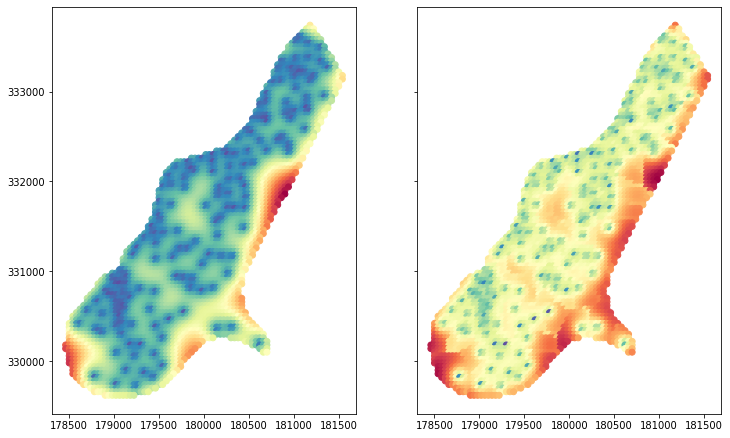

## Comparison of Ordinary Kriging in `Pyinterpolate` and `gstat` package

Up to date the most popular package for Kriging is **gstat** [@PEBESMA2004683] written in the R programming language. Existence of this software allows to compare **point Kriging** operations between packages. The `meuse` dataset provided with the R package **sp** [@PebesmaSPArt; @BivandBook] is used in this example. This dataset contains measurements of four heavy metals concentration in the top soil in a flood plain along the river Meuse [@meuse]. Code for this comparison is given in the dedicated notebook available in the paper repository with url given in the \autoref{appendix}.

From four metals concentration of zinc is used in this example. Variogram modeling and kriging are performed semi-automatically in both cases with a common setting related to the kriging itself - with the number of neighbours. Variogram modeling is different. In the case of **gstat** package variogram was derived as a Spherical model with nugget equal to the first three values of experimental semivariances, sill is equal to the mean of the last five values of experimental semivariances and range which is 1/3 of the maximum distance. Lags between steps are not equal. On the contrary, **pyinterpolate** fits a semivariogram automatically based on the lowest RMSE between theoretical model and experimental values. It is an iterative process. Based on the given number of ranges equally spaced lags are created and for each lag range equal to it is set and calculates RMSE between experimental points and modeled curve. This process is repeated for each type of theoretical model. Model and range with the lowest error are chosen. In this case the Spherical model is the best. Nugget is equal to the first value of experimental semivariance (usually it is 0 or value very close to the 0). Sill is set to the variance of the whole dataset. Interpolation grid is derived from the **sp** package.

The ordinary Kriging interpolation is performed for both packages. Predictions and prediction variance error terms are calculated and compared. Scatterplot of **pyinterpolate** output versus **gstat** output is presented in the \autoref{fig8}. Calculated Pearson correlation coefficient between both outputs is extremely high and close to the 0.99 with p-value close to the 0.

 
 
 Pattern of predicted values and variance errors are very similar in both cases. \autoref{fig9} shows predicted output of **gstat** package and **pyinterpolate** and \autoref{fig10} shows maps of variance errors from the both packages.
 
  
 
  